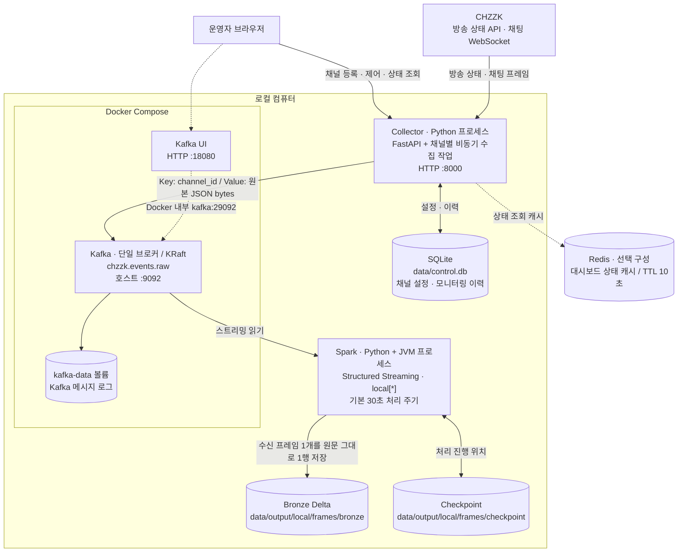
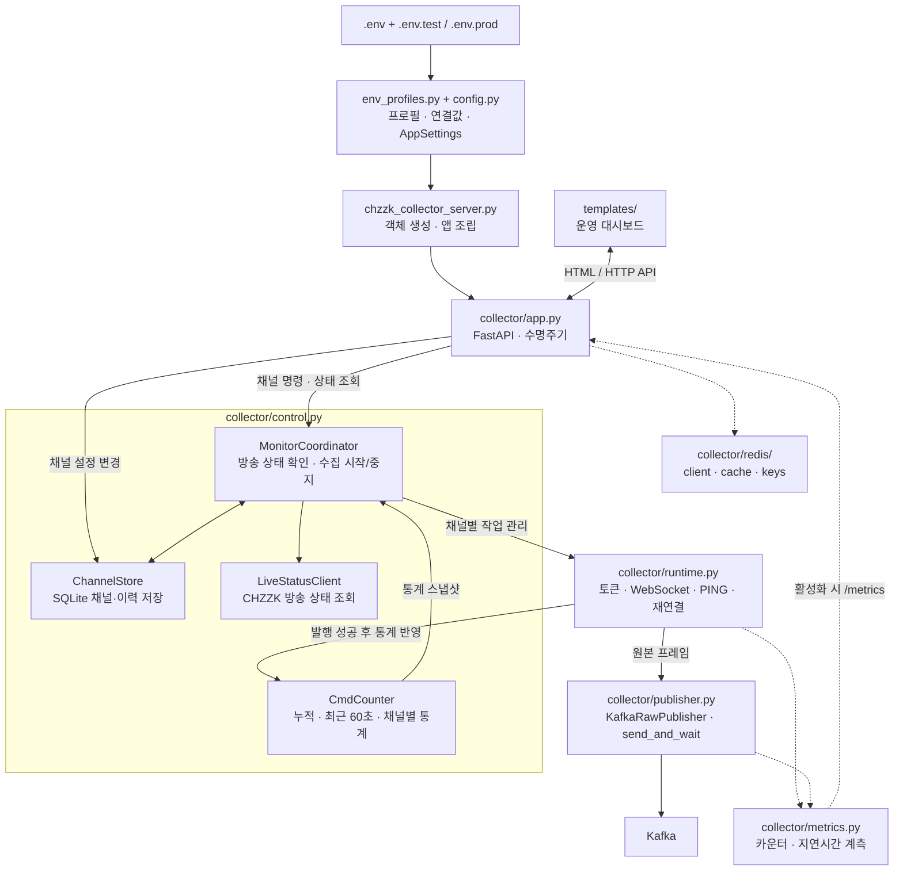
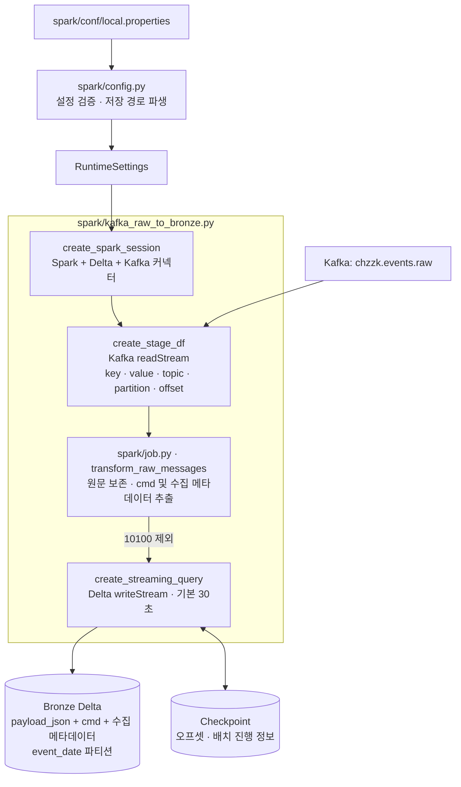

# 시스템 아키텍처

2026-09-19 로컬 작업 트리의 Kafka 기본 경로 기준. 이 문서는 구성과 코드 연결을 설명하며, 프로세스의 현재 실행 여부를 표시하지 않는다.

## 1. 전체 시스템 구성

실선은 기본 데이터·제어 흐름, 점선은 선택 기능 또는 관리용 연결이다.

- Collector 내부 모듈은 하나의 Python 프로세스에서 동작한다. 채널마다 별도 서버를 띄우지 않고 비동기 작업을 만든다.
- Kafka와 Kafka UI는 각각 Docker 컨테이너다. 기본 Compose에 Collector·Spark·Redis 컨테이너는 없다.
- Spark는 Collector와 별도로 시작하고 종료한다. 기본 실행 경로에 GCS와 Google 인증은 필요하지 않다.
- 대시보드는 Collector의 메모리 통계를 보여준다. 현재 Spark 결과를 읽는 분석 API/화면은 연결되어 있지 않다.

## 2. Collector 모듈 연결

아래 화살표는 호출 또는 데이터 전달 관계다. 각 박스는 독립 서비스가 아니라 코드 모듈/클래스다.

| 모듈 | 책임 | 주요 경계 |
|---|---|---|
| [chzzk_collector_server.py](../chzzk_collector_server.py) | 기본 실행 진입점, 객체 조립 | `run_server.sh` → Uvicorn → `app` |
| [collector/app.py](../collector/app.py) | HTTP API, 템플릿, 시작·종료 | 채널 명령을 Coordinator/Store에 전달 |
| [collector/env_profiles.py](../collector/env_profiles.py), [config.py](../collector/config.py) | 프로필 선택, 설정 로딩 | `.env`와 선택 프로필 → `AppSettings` |
| [collector/control.py](../collector/control.py) | 채널 저장, 방송 조회, 작업 조율, 통계 | SQLite·CHZZK API·수집 작업 관리 |
| [collector/runtime.py](../collector/runtime.py) | 토큰 발급, WebSocket 연결/수신/PING/재연결 | 원본 발행 후 통계 갱신 |
| [collector/event_bus.py](../collector/event_bus.py) | 백엔드 이름 검증, 공통 계약 | Kafka가 기본, Pub/Sub는 명시적 선택 |
| [collector/publisher.py](../collector/publisher.py) | 백엔드 선택, 메시지 직렬화·발행 | 실제 수신 경로는 원본 bytes 재사용 |
| [collector/redis/cache.py](../collector/redis/cache.py) | 대시보드 상태 JSON 캐시 | Redis 미사용/장애 시 상태 직접 조회 |
| [collector/metrics.py](../collector/metrics.py) | 수신량, 발행 성공/실패, 지연 계측 | `METRICS_ENABLED=true`일 때 HTTP 노출 |
| [collector/templates/dashboard.html](../collector/templates/dashboard.html) | 채널 제어·수집 현황 화면 | `/dashboard/api/state`를 주기적으로 조회 |

주요 API: `POST/GET/DELETE /channels`, `PATCH /channels/{channel_id}/enabled`, `GET /stats`, `GET /dashboard`, `GET /dashboard/api/state`.

Kafka에는 WebSocket 프레임 한 개를 메시지 한 개로 보낸다. 프레임 안에 채팅 여러 건이 있으면 통계 건수는 Kafka 메시지 수보다 많을 수 있지만 Bronze는 프레임당 한 행이다. `10100`은 SQLite 연결 이력으로 처리하고 발행하지 않는다. `CmdCounter`는 메모리 상태이므로 Collector 재시작 시 초기화된다.

## 3. Spark 모듈과 데이터 처리

- [spark/kafka_raw_to_bronze.py](../spark/kafka_raw_to_bronze.py)가 기본 실행 진입점이다. `spark.run` 라이브러리 경로도 같은 `transform_raw_messages`를 사용한다.
- [spark/config.py](../spark/config.py)는 `app.bucket.uri=data/output/local/frames`에서 새 `bronze`, `checkpoint` 경로를 만든다. 기존 `data/output/local`의 채팅 테이블과 체크포인트는 보존한다.
- Kafka 메시지 한 개가 Bronze 한 행이다. `payload_json`은 원문을 그대로 보존하며 `bdy`가 배열·객체·빈 값이어도 저장한다. cmd 추출 실패 시 `cmd=null`로 남긴다. 새 Bronze 작업은 DLQ를 쓰지 않는다.
- `10100` 연결 응답은 SQLite 전용이다. 과거 Kafka에 남은 연결 응답도 Bronze에서는 제외한다.
- 최초 로컬 실행은 `earliest`로 Kafka에 남은 데이터를 읽는다. 이후에는 같은 새 체크포인트로 재시작하며, Delta의 직접 스트리밍 쓰기를 사용한다.
- 메시지별 행 분리, 이벤트별 타입·필수값 검증은 이후 Silver에서 수행할 예정이다. Collector에서 JSON 파싱에 실패한 프레임은 현재 Kafka 발행 전 제외되므로 이 Bronze 보존 범위에 포함되지 않는다.

## 4. 보조 구성과 현재 범위

| 구성 | 코드/설정 | 위치와 역할 |
|---|---|---|
| Kafka + UI | [kafka/compose.yaml](../kafka/compose.yaml) | 단일 브로커와 관리 UI, Kafka 로그 볼륨 |
| 재생 벤치마크 | `collector/benchmark_input.py`, `benchmark_replay.py`, `benchmark_matrix.py` | 입력 생성 → 실제 수신·발행 코드 재생 → 반복 측정 |
| 관측 도구 | [kafka/compose.benchmark.yaml](../kafka/compose.benchmark.yaml) | 선택 실행: Prometheus·Grafana·cAdvisor·Kafka JMX exporter |
| Delta 유지보수 | [spark/delta_maintenance.py](../spark/delta_maintenance.py) | 별도 실행하는 보존기간/VACUUM 도구. 기본 대상은 이전 `chat_bdy_stream` 경로이므로 새 local 테이블은 대상 경로를 명시해야 함 |
| 컨테이너 이미지 발행 | [.github/workflows/docker-image.yml](../.github/workflows/docker-image.yml) | main push 시 Collector 이미지를 GHCR에 발행. 전체 시스템을 자동 배포하는 구성은 아님 |
| 선택·이전 경로 | Pub/Sub publisher/bootstrap/watcher, GCS용 dev/prod properties | 코드에 남아 있으나 현재 Kafka+로컬 기본 흐름에서는 사용하지 않음 |
| 호환 진입점 | `chzzk_control.py`, `kafka_raw_publisher.py` | collector 모듈을 재노출하는 얇은 파일 |

현재 기본 파이프라인의 끝은 프레임 단위 Bronze 적재다. Silver/Gold 집계, 감정·키워드 분석, Spark 결과 조회 API는 아직 기본 흐름에 연결되어 있지 않다.

실행 순서는 [README의 빠른 시작](../README.md#빠른-시작)을 참고한다.
