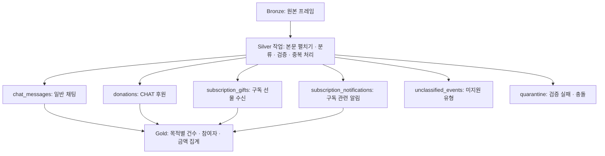

# Silver 테이블 분리 설계 및 데이터 계약 v3

작성일: 2026-09-22. v3는 추가 Bronze v475 샘플에 따른 개선을 포함한다(9절). 상태: **로컬 Silver 구현 및 고정 샘플 검증 완료**, 파서 계약 `silver-v3.1`.

이 문서는 기존 단일 `silver.chat_events` 제안을 대체한다. 분석용 `silver.chat_messages`, `silver.donations`, `silver.subscription_gifts`, `silver.subscription_notifications`와 관리용 `silver.unclassified_events`, `silver.quarantine`으로 물리적 Delta 테이블을 나눈다. 각 테이블의 행 단위, 필수값, 중복 및 품질 처리 규칙과 적재 순서를 정한다. 실행법은 [README](../README.md)에 설명한다.

목적은 채널별 채팅량·참여자·시간대 분석과 후원·구독 선물 분석에 재사용할 수 있는 개별 이벤트를 만드는 것이다. Silver에서 분류·정제·검증·중복 처리를 끝내고, 지표별 집계는 Gold에서 수행한다.

수치 근거는 앞서 고정해 점검한 Bronze Delta v41의 2026-09-22 수집분이다. 일반 채팅 5,883건, CHAT 후원 28건, 구독 선물 수신 알림 1건을 확인했다. 현재까지의 전체 누적량은 아니다. 이 짧은 관측이 CHZZK 전체 프로토콜이나 식별자의 전역 유일성을 입증하지는 않는다. 아래 중복 키는 확인된 유형에 적용할 초기 정책이다.



네 분석 테이블은 공통 부모 테이블의 상세 테이블이 아니다. 각 행에 채널·시각·원본 좌표를 직접 저장하므로 단독 조회할 수 있다. 후원 메시지는 본문 텍스트가 있어도 donations에만 저장하고 chat_messages에 중복 저장하지 않는다. 전체 이벤트 조회가 필요하면 나중에 공통 컬럼을 UNION ALL하는 뷰를 추가할 수 있으며, 통합 테이블을 한 벌 더 저장하지 않는다.

## 1. 행의 의미와 범위

**분석용 Silver 테이블의 한 행은 검증을 통과하고 아래 중복 규칙을 적용한 해당 유형의 이벤트 한 건이다.** 방송 한 회, 사용자 한 명, 후원 합계, 현재 채팅 화면의 상태를 나타내는 행이 아니다. 공통 계약을 통과한 대상 항목은 분류 결과에 따라 하나의 테이블로만 보낸다.

| 목적지 테이블 | 분류 조건 | 한 행의 의미 |
|---|---|---|
| `silver.chat_messages` | 유효 cmd=93101, msgTypeCode=1 | 수신한 일반 채팅 한 건. `CBOTBLIND` 상태도 포함 |
| `silver.donations` | cmd=93102, msgTypeCode=10, extras.donationType=CHAT | 식별된 채팅 후원 이벤트 한 건 |
| `silver.subscription_gifts` | cmd=93102, msgTypeCode=12, extras.giftType=SUBSCRIPTION_GIFT_RECEIVER | 특정 수신자에 대한 구독 선물 수신 알림 한 건 |
| `silver.subscription_notifications` | cmd=93102, msgTypeCode=11 | 구독 개월 수가 담긴 구독 관련 알림 한 건. 신규 가입·갱신·결제 완료 구분은 미확정 |
| `silver.unclassified_events` | cmd=93101 또는 93102이고 공통 구조는 유효하나 위 조합으로 분류되지 않음 | 세부 의미가 아직 확정되지 않은 채팅 계열 항목 |
| `silver.quarantine` | 원문·필수 필드 검증 실패 또는 키 충돌 | 실패한 원본 항목 하나와 오류 목록 |

- `bdy` 배열은 원소마다 펼친다. `body_index`는 원본의 0부터 시작하는 배열 위치다. 잘못된 항목이 있어도 뒤 항목의 인덱스를 당기지 않는다.
- `bdy`가 객체면 한 행으로 해석하고 `body_index=0`을 부여한다.
- 빈 배열은 이벤트 0건이다. 가짜 null 행을 만들지 않고 `empty_body_frames`에 집계한다.
- 대상 이벤트의 bdy가 없거나 null/스칼라이면 프레임 수준으로 격리한다. 배열의 잘못된 원소는 해당 원소만 격리한다.
- `source_cmd`는 프레임 cmd, `cmd`는 항목 cmd가 있으면 그 값, 없으면 프레임 cmd다. 명시적으로 존재하지만 해석할 수 없는 항목 cmd를 프레임 cmd로 덮어쓰지 않는다.
- `94008` 차단 이벤트, `93006` 광고, `94010` 기존 채팅 재참조 프레임 등 유효한 범위 밖 cmd는 Bronze에 보존하고 cmd별 `out_of_scope` 건수를 기록한다. 이번 범위의 Silver 테이블에는 넣지 않는다. 알려지지 않은 cmd의 관측 건수도 기록한다.
- 일반 신규 구독·갱신을 선물 알림이나 발신자 프로필에서 추정하지 않는다. type=11은 구독 관련 알림으로 별도 저장하되 신규 가입·갱신·결제 완료의 구분을 추정하지 않는다. 새로운 분류는 실제 원본과 회귀 사례를 확인한 뒤 추가한다.
- `message_status`는 해당 메시지에 담긴 수신 당시 상태다. 후속 `94008`을 반영한 최종 노출 상태는 이번 범위에서 보장하지 않는다.
- cmd 자체의 누락·해석 실패는 유효한 범위 밖 이벤트로 취급하지 않고 격리한다.

## 2. 스키마와 필수값

각 테이블의 스키마는 **공통 컬럼 + 그 테이블의 유형별 컬럼**이다. 공통 컬럼은 아래 다섯 테이블에 각각 실제로 존재한다. quarantine은 실패 데이터를 담으므로 4절의 별도 스키마를 사용한다. chat_messages에는 pay_amount나 gift_id 컬럼 자체가 없고, donations에는 gift_id 컬럼이 없다. 선택값의 NULL은 0, 빈 문자열, 비구독 상태와 구분한다.

### 2.1 공통 계약

| 컬럼 | 타입 | 필수 여부 및 규칙 |
|---|---|---|
| `topic` | STRING | 필수. 비어 있지 않은 Kafka topic |
| `partition` | INT | 필수. 0 이상 |
| `offset` | BIGINT | 필수. 0 이상 |
| `body_index` | INT | 정상 이벤트는 필수, 0 이상 |
| `channel_id` | STRING | 필수. 비어 있지 않은 Bronze channel_id를 사용 |
| `source_cmd`, `cmd` | INT | 필수. 정수로 해석 가능해야 함 |
| `message_type_code` | INT | 필수. bdy.msgTypeCode에서 추출 |
| `msg_time_ms` | BIGINT | 필수. bdy.msgTime, 0 이상 epoch milliseconds |
| `event_time` | TIMESTAMP | 필수. msg_time_ms에서 UTC instant로 변환. 변환 범위를 벗어나면 격리 |
| `event_date_kst` | DATE | 필수. event_time의 Asia/Seoul 날짜 |
| `kafka_timestamp` | TIMESTAMP | 필수. Bronze 값을 보존 |
| `bronze_ingested_at` | TIMESTAMP | 필수. Bronze ingested_at을 보존 |
| `silver_processed_at` | TIMESTAMP | 필수. Silver 처리 시각. 식별/중복 판단에는 사용하지 않음 |
| `quality_flags` | ARRAY<STRING> | 필수. 이상이 없으면 빈 배열. 경고 코드를 중복 없이 정렬 |
| `chat_channel_id` | STRING | 선택. bdy.cid. channel_id의 대체값으로 쓰지 않음 |
| `message_status` | STRING | 선택. 원본 msgStatusType 보존. 누락은 NULL + MISSING_MESSAGE_STATUS |

정수 필드는 JSON 정수 또는 부호를 포함할 수 있는 10진 정수 문자열을 허용한다. bool, 소수, 지수 표기 문자열, 범위 초과를 묵시적으로 잘라서 변환하지 않는다. 문자열 식별자는 비어 있거나 공백만 있으면 누락으로 판단하며 대소문자를 바꾸지 않는다. 원문 메시지는 trim·소문자화·반복 문자 제거를 하지 않는다.

`event_time`이 Kafka timestamp보다 5분 넘게 미래면 `EVENT_TIME_TOO_FAR_IN_FUTURE`로 격리한다. 5분은 프로토콜 사실이 아닌 초기 설계의 보수적인 품질 허용치다. 관측된 -10ms 정도의 지연 차이는 허용한다. 오래되었거나 늦게 도착했다는 이유만으로 이벤트를 버리지 않으며 이 정제 단계에는 워터마크에 따른 삭제를 두지 않는다. msgTime 누락을 Kafka timestamp 또는 ctime으로 대체하지 않는다.

### 2.2 공통 메시지 속성

아래 컬럼도 다섯 테이블 각각에 둔다. 기본은 선택값이며, chat_messages의 message에만 문자열 필수 조건을 추가한다. 테이블명이 이벤트 유형을 나타내므로 상수 event_type 컬럼은 중복 저장하지 않는다. 처리 중 분류값과 quarantine의 추정 event_type은 사용할 수 있다.

| 컬럼 | 타입 | 원천 및 의미 |
|---|---|---|
| `actor_user_id` | STRING | bdy.uid. 메시지 주체이며 항상 결제자 또는 선물 수신자라는 뜻은 아님 |
| `nickname` | STRING | profile.nickname. 이벤트 당시 표시명이며 사용자 키가 아님 |
| `actor_user_role` | STRING | 선택. profile.userRoleCode 원본 코드. 역할을 봇 여부나 계정 신원으로 확대 해석하지 않음 |
| `message` | STRING | bdy.msg. 일반 채팅은 문자열 필수, 빈 문자열은 허용하고 EMPTY_MESSAGE 경고 |
| `sender_subscription_months` | INT | profile.streamingProperty.subscription.accumulativeMonth. 발신자의 당시 구독 상태, 있으면 0 이상 |
| `sender_subscription_tier` | INT | 같은 subscription.tier. 있으면 1 이상 |

### 2.3 유형별 스키마

`silver.chat_messages`는 2.1과 2.2의 컬럼으로 완성된다. message 이외의 메시지 속성은 선택값이다. `sender_subscription_*`가 있는 행도 일반 채팅이며 구독 발생 행이 아니다.

`silver.donations`는 공통 컬럼에 아래 다섯 필수 컬럼을 추가한다. 이번 범위는 CHAT 후원이며 다른 후원 유형을 임의로 끼워 넣지 않는다.

| 컬럼 | 타입 | 필수 조건 |
|---|---|---|
| `donation_id` | STRING | 비어 있지 않은 extras.donationId |
| `donation_type` | STRING | extras.donationType=CHAT |
| `pay_type` | STRING | 비어 있지 않은 extras.payType. 원본 코드 보존, 임의 통화 변환 없음 |
| `pay_amount` | BIGINT | extras.payAmount, 0 이상 정수. 원본 단위이며 랭킹 금액을 사용하지 않음 |
| `is_anonymous` | BOOLEAN | extras.isAnonymous, boolean 필수 |

`silver.subscription_gifts`는 공통 컬럼에 아래 컬럼을 추가한다. 한 행은 수신자 한 명에 대한 선물 수신 알림이며, 하나의 결제나 일반 구독 가입 전체를 뜻하지 않는다.

| 컬럼 | 타입 | 필수 조건 |
|---|---|---|
| `gift_id` | STRING | 비어 있지 않은 extras.giftId |
| `gift_type` | STRING | extras.giftType=SUBSCRIPTION_GIFT_RECEIVER |
| `recipient_user_id` | STRING | 비어 있지 않은 extras.receiverUserIdHash. actor_user_id와 별개 |
| `gift_tier_no` | INT | 선택. extras.giftTierNo, 있으면 1 이상 |

| 테이블 | 공통 계약 외의 필수값 | 정상적으로 NULL을 허용하는 주요 값 |
|---|---|---|
| `chat_messages` | `message`는 문자열 | actor_user_id, nickname, 구독 상태 |
| `donations` | donation_id 비어 있지 않음, donation_type=CHAT, pay_type 비어 있지 않음, pay_amount는 0 이상 정수, is_anonymous는 boolean | 익명 사용자·프로필, message, 구독 상태 |
| `subscription_gifts` | gift_id, recipient_user_id가 비어 있지 않음, gift_type=SUBSCRIPTION_GIFT_RECEIVER | actor_user_id, nickname, message, gift_tier_no, 구독 상태 |
| `subscription_notifications` | type=11의 extras.month가 0 이상 정수 | actor_user_id, nickname, message, subscription_tier_no, subscription_tier_name |

`silver.subscription_notifications`는 공통 컬럼에 아래 속성을 추가한다. 분류는 cmd와 msgTypeCode로 먼저 결정하고 month가 잘못되면 quarantine으로 보낸다. 원본 msg가 관측 9건 모두 개월 수 문자열이었지만 사용자 채팅 문장으로 집계하지 않는다.

| 컬럼 | 타입 | 필수 조건 |
|---|---|---|
| `subscription_months` | INT | 필수. type=11의 extras.month에서 추출, 0 이상 정수. 0은 미관측이므로 ZERO_SUBSCRIPTION_MONTHS 경고 |
| `subscription_tier_no` | INT | 선택. type=11의 extras.tierNo, 있으면 1 이상 |
| `subscription_tier_name` | STRING | 선택. type=11의 extras.tierName 원문 |

발신자의 `sender_subscription_months`와 알림의 `subscription_months`는 서로 다른 원천 필드다. 관측 9건에서 값이 같았더라도 하나로 합치거나 누락 시 서로 대체하지 않는다. 구독 거래 ID는 관측되지 않아 원본 항목 키로 재처리 중복만 제거한다. 같은 사용자·같은 개월 수라는 이유로 다른 원본 위치의 알림을 삭제하지 않는다.

### 2.4 미지원 유형과 적용 규칙

`silver.unclassified_events`는 공통 컬럼에 `classification_reason STRING NOT NULL`, `observed_donation_type STRING NULL`, `observed_gift_type STRING NULL`을 추가한다. 후자의 두 값은 해석 가능한 원본 분류 문자열만 보존한다. 기본 사유는 UNSUPPORTED_EVENT_COMBINATION이며 quality_flags에 UNCLASSIFIED_EVENT를 남긴다. 전체 extras를 복사하거나 금액·수신자의 의미를 추정하지 않는다.

미분류는 "원본이 잘못됐다"가 아니라 "현재 파서의 지원 범위 밖이다"라는 뜻이다. 이후 샘플을 확인해 유형을 지원할 때 Bronze에서 재정제하고 기존 미분류 행과 이중 집계되지 않도록 새 출력으로 전환한다. 이하 unknown은 이 테이블의 분류 상태를 뜻한다. type=30의 시스템 안내는 현재 분석 테이블의 지원 범위 밖이므로 classification_reason=SYSTEM_MESSAGE_NOT_MODELED로 보존한다. 공통 구조가 유효하고 profile이 빈 객체라는 이유만으로 격리하지 않는다. 원본 extras.description·visibleRoles·params는 Bronze에 남기며 이 테이블을 공개 채팅 내역으로 노출하지 않는다.

- 알려진 유형의 필수값이 없으면 `unknown`으로 우회시키지 않고 격리한다. 예: 명확한 CHAT 후원에서 payAmount만 누락된 경우.
- cmd=93102/type=11의 extras 또는 필수 month 해석 실패는 quarantine 대상이다.
- cmd=93102/type=10의 extras 또는 donationType, cmd=93102/type=12의 extras 또는 giftType을 해석할 수 없으면 분류 필드 오류로 격리한다. 분류 필드가 유효한 문자열이지만 미지원 값이면 unknown이다. 따라서 필수 분류 필드의 누락과 새로운 유형의 출현을 구분한다.
- `pay_amount=0`은 허용하되 ZERO_PAY_AMOUNT 경고를 남긴다. 미관측이라는 이유만으로 0을 불가능한 값으로 단정하지 않는다. 음수·소수·문자 해석 실패·overflow는 격리한다.
- `pay_type=CURRENCY`는 원화라는 뜻으로 변환하지 않는다. 다른 pay_type이 관측되면 보존하고 UNRECOGNIZED_PAY_TYPE 경고를 남긴다. 금액은 pay_type별로 구분하며 단위 확인 전 서로 합산하지 않는다.
- profile/extras는 JSON 문자열 또는 객체를 해석한다. 누락과 JSON 해석 실패는 별개다. 후원·선물은 extras가 유효한 객체여야 한다.
- 후원에서 isAnonymous=true이면 uid 값과 무관하게 actor_user_id·nickname·actor_user_role·sender_subscription_*를 NULL로 둔다. 원문은 Bronze에 남는다. 미지원 유형도 명시적인 extras.isAnonymous=true가 있으면 같은 비식별 규칙을 적용한다.
- uid의 `anonymous` sentinel은 actor_user_id=NULL로 정규화한다. 후원에서 isAnonymous=false인데 uid가 anonymous이면 ANONYMITY_CONFLICT로 격리한다. 일반적인 uid 누락은 사용자 관련 지표에서 제외하고 MISSING_ACTOR_USER_ID 경고를 남긴다.
- 식별 가능한 bdy.uid와 profile.userIdHash가 서로 다르면 bdy.uid를 보존하고 profile에서 가져오는 nickname·actor_user_role·구독 속성은 NULL로 둔다. PROFILE_USER_MISMATCH 경고를 남긴다.
- extras.streamingChannelId가 없으면 정상이다. 값이 있는데 Bronze channel_id와 다르면 CHANNEL_ID_CONFLICT로 격리한다. bdy.cid가 다른 것은 서로 다른 식별자 영역이므로 이 검사 대상이 아니다.
- 선택 profile의 해석 실패는 profile 유래 컬럼을 NULL로 두고 INVALID_OPTIONAL_PROFILE 경고를 남긴다. 일반 채팅의 선택 extras 해석 실패는 INVALID_OPTIONAL_EXTRAS 경고다. 선택 필드의 잘못된 타입·범위는 해당 값만 NULL로 두고 INVALID_OPTIONAL_FIELD 경고를 남긴다.
- 발신자 구독 상태는 profile.streamingProperty.subscription에서만 추출한다. 일반 채팅의 extras.month·tierNo·durationTime은 관측상 0이 들어온 경우가 있으므로 이를 발신자 구독 상태로 대체하지 않는다. durationTime의 단위·의미도 추정하지 않는다.
- profile의 badge/title은 null 또는 객체 모두 허용한다. 이번 Silver는 이 필드를 추출하지 않으므로 객체가 나타났다는 이유로 profile 전체를 파싱 실패 처리하지 않는다. actor_user_role은 알려지지 않은 문자열 코드도 그대로 보존하고 필수 enum 검증으로 차단하지 않는다.
- `msgTid`, `cuid`는 필수값이나 공통 키로 사용하지 않는다. 전체 profile/extras 및 extraToken은 정상 Silver 테이블에 복사하지 않는다.

## 3. 중복 기준

### 3.1 원본 항목 식별과 재처리

원본 키는 **`(topic, partition, offset, body_index)`**다. 이 튜플은 분석용 네 테이블과 unclassified_events 전체에서 최대 한 행에만 대응해야 한다. 재전달로 생긴 별도 원본 키는 아래 업무 중복 규칙의 대상이다. 별도 해시 event_id는 만들지 않는다.

- 같은 키와 같은 정제 결과가 재입력되면 이미 처리한 항목으로 보고 새 행을 추가하지 않는다. silver_processed_at과 quality_flags 정렬 차이는 내용 비교에서 제외한다.
- 같은 원본 키의 분석 값이 달라지면 덮어쓰지 않고 SOURCE_KEY_CONFLICT로 보류한다. 파서 변경을 같은 체크포인트에 임의 적용하는 방식으로 해결하지 않는다.
- 이 규칙의 입력 전제는 Kafka 좌표별 원문 불변성이다. 작업은 쓰기 전에 배치 좌표를 Bronze 전체 이력과 대조한다. 같은 `(topic, partition, offset)`에 서로 다른 원문·채널·Kafka 시각이 있으면 Bronze 무결성 위반으로 배치를 중단한다. 업무 중복으로 생략한 좌표나 범위 밖·빈 본문으로 바뀐 원본도 이 검사에 포함한다. 이 경우 항목별 격리로 계속 진행하지 않고 Bronze를 복구한 뒤 재시도한다.
- 같은 원문을 다시 적재하며 `ingested_at`만 달라진 경우는 내용 충돌로 보지 않는다. 기존 정상 행의 수집 시각을 유지한다. Bronze 원문을 삭제·덮어쓰거나 같은 경로에 다른 원천으로 교체하는 운영은 지원하지 않는다.
- 이 키의 유일성 범위는 현재 단일 Kafka 클러스터와 토픽의 수명이다. 토픽을 삭제·재생성한 입력은 기존 Silver에 그대로 이어 쓰지 않는다. 그런 운영이 필요해지면 source_epoch를 키에 추가한다.
- 파서·스키마를 바꾸는 전체 재정제는 새 출력과 새 체크포인트로 수행하고 검증 후 전환한다.

### 3.2 서로 다른 원본 위치로 들어온 이벤트

| 테이블 | 업무 중복 후보 키 | 처리 |
|---|---|---|
| `chat_messages` | 없음 | 다른 원본 위치이면 보존. 사용자·문장·시각이 같다는 이유로 제거하지 않음 |
| `donations` | `(channel_id, donation_id)` | 아래 핵심값까지 같을 때만 동일 후원 재전달로 취급 |
| `subscription_gifts` | `(channel_id, gift_type, gift_id, recipient_user_id)` | 같은 선물이라도 다른 수신자는 별개. 아래 핵심값까지 같은 경우만 중복 |
| `subscription_notifications` | 확인된 거래 키 없음 | 원본 키의 재처리 중복만 제거. 사용자+개월 수를 거래 ID처럼 사용하지 않음 |
| `unclassified_events` | 없음 | 원본 키의 재처리 중복만 제거 |

후원의 핵심값은 msg_time_ms, actor_user_id, is_anonymous, donation_type, pay_type, pay_amount, message, message_status다. 선물의 핵심값은 msg_time_ms, actor_user_id, gift_type, gift_id, recipient_user_id, gift_tier_no, message, message_status다. 테이블이 같아야 비교한다. NULL은 NULL끼리 같은 값으로 비교한다. nickname·actor_user_role·발신자 구독 상태·랭킹·수집/처리 시각은 업무 중복 비교값이 아니다.

- 후보 키와 핵심값이 모두 같으면 정상 행 하나만 유지한다. 처음 정상 저장된 행의 원본 좌표를 유지한다. 기존 행이 없고 한 배치 안에 후보가 여러 개면 원본 키의 사전순으로 대표를 결정한다. 이는 발생 순서를 추정하는 규칙이 아니라 재시도 결과를 일정하게 만드는 규칙이다. 나머지는 중복 건수에 집계하고 모든 원본은 Bronze에 남긴다.
- 후보 키가 같은데 핵심값이 다르면 단순 중복이 아닌 BUSINESS_KEY_CONFLICT다. 먼저 들어온 값이나 더 큰 금액을 임의로 정답으로 선택하지 않는다. 관련 행들을 정상 분석 대상에서 제외하고 충돌 그룹을 격리한다. 이미 정상 저장한 행이 있으면 그 행도 보류 대상으로 전환해야 한다.
- 충돌이 판명된 키의 후속 입력도 해결 전까지 격리한다. 수정된 규칙으로 원본을 재처리해 해결한다.
- 위 정책은 식별자의 전역 유일성을 입증했다는 주장이 아니다. 반복 키에 다른 내용이 나타나는 경우를 숨기지 않고 드러내는 초기 정책이다.

**구현 제약:** 체크포인트와 단순 Delta append만으로는 서로 다른 offset의 업무 중복 제거 및 기존 충돌 행의 제외를 보장할 수 없다. 이번 설계는 키 기반 MERGE와 충돌 격리·제외를 사용한다. 처리 순서는 7절과 같다.

## 4. 품질 실패 처리

정상 출력의 quality_flags는 허용 가능한 경고를 나타낸다. 필수값 오류와 충돌이 있는 행을 경고만 붙여 정상 테이블에 남기지 않는다. unknown은 공통 구조만 검증됐으며 세부 유형의 분석에서는 제외한다.

| 경우 | 정상 테이블 | 격리 테이블 / 기록 |
|---|---|---|
| 모든 필수값 충족 | 저장 | 없음 |
| 익명 후원의 profile NULL, 채팅의 구독 상태 없음 | 정상 저장 | 정상적인 부재로 처리 |
| 선택 profile·선택 필드 해석 실패 | 영향받는 선택 컬럼만 NULL + 경고 | 오류율 집계 |
| 필수 channel_id/msgTime/msgTypeCode 누락·잘못된 타입 | 저장하지 않음 | 필드와 사유를 기록해 격리 |
| CHAT 후원의 필수 금액·ID·익명 여부 실패 | 저장하지 않음 | 필드와 사유를 기록해 격리. 금액을 0으로 대체하지 않음 |
| 알려진 선물 수신 알림의 선물 ID·수신자 실패 | 저장하지 않음 | 필드와 사유를 기록해 격리 |
| JSON 파손·대상 본문 형식 오류 | 저장하지 않음 | 프레임 또는 해당 배열 원소만 격리 |
| 지원하지 않는 채팅 세부 유형 | unclassified_events로 저장, UNCLASSIFIED_EVENT 경고 | 미분류 건수 집계 |
| 유효한 범위 밖 cmd | 저장하지 않음 | Bronze 유지 + cmd별 out_of_scope 건수 |
| 같은 원본/업무 키의 동일 내용 | 기존 정상 행만 유지 | 중복 건수 집계 |
| 같은 원본/업무 키의 상충 내용 | 해당 그룹을 정상 분석에서 제외 | 충돌 그룹 격리 |
| 저장소·체크포인트·실행 환경 장애 | 성공으로 처리하지 않음 | 작업 실패 및 재시도. 데이터 오류로 간주해 건너뛰지 않음 |

quarantine의 한 행은 **검증에 실패한 원본 항목 하나와 그 항목의 오류 목록**이다. 필드 오류가 여러 개여도 같은 항목을 오류 수만큼 복제하지 않는다.

Kafka 원본 좌표인 topic/partition/offset 자체가 누락되거나 유효하지 않으면 안정적인 재처리·추적 키를 만들 수 없다. 이는 Bronze 입력 계약 위반으로 해당 배치를 실패시키고 원천을 점검한다. 임의 ID로 오류 항목을 계속 적재하지 않는다.

| 컬럼 | 타입 | 규칙 |
|---|---|---|
| `topic`, `partition`, `offset`, `body_index` | STRING, INT, BIGINT, INT | 필수 원본 좌표. 프레임 전체 오류는 body_index=-1, 원소 오류는 원래 index |
| `channel_id`, `source_cmd`, `event_type` | STRING, INT, STRING | 확보 가능한 값만 저장, 실패 필드는 NULL 허용 |
| `error_codes`, `error_fields` | ARRAY<STRING> | 필수. 오류 코드는 최소 한 개, 필드 경로는 해당할 때 기록. 중복 제거·정렬 |
| `parser_version` | STRING | 필수. 적용한 파서 계약의 고정 버전 |
| `detected_at` | TIMESTAMP | 필수. 최초 격리 시각, 재시도 시 유지 |
| `conflict_keys` | ARRAY<STRING> | 필수. 비충돌이면 빈 배열. 원본·업무 충돌 키 각각을 고정된 JSON 배열로 직렬화하여 여러 차단 키를 함께 보존 |
| `related_sources` | ARRAY<STRUCT<topic:STRING,partition:INT,offset:BIGINT,body_index:INT>> | 필수. 비충돌이면 빈 배열. 충돌 조정마다 대표 좌표 최대 2개와 자기 좌표를 추가하고 중복 제거·정렬; 기존 기록과 병합하면 더 많을 수 있음 |

원본 좌표로 Bronze 프레임을 다시 조회한다. 토큰이 포함된 전체 원문을 오류 메시지에 복사하지 않는다. 같은 오류 행의 재입력은 오류·관련 좌표를 집합으로 병합하며, 동일 배치의 재시도만으로 내용이나 행 수가 늘어나지 않아야 한다.

관련 좌표 배열은 전체 충돌 그룹을 매 행마다 복제하지 않는다. 전체 재전달 목록은 Bronze에서 조회한다. 단일 `conflict_key` 대신 배열을 쓰는 이유는 원본 충돌과 업무 충돌이 연결된 경우 모든 업무 키의 재삽입을 막아야 하기 때문이다.

quarantine 재처리 시 동일 `(원본 키, parser_version)` 오류 행을 중복 추가하지 않는다. 검증 오류 한 건 때문에 같은 프레임의 정상 항목까지 버리지 않는다. 여섯 테이블에 대한 원자적 동시 커밋을 가정하지 않으며, 완료된 동일 입력 범위에서 결과를 대조한다. 오류 원문 복구 가능성은 Bronze의 보존기간 안에서 보장한다.

## 5. 분석에서의 사용 계약

- 일반 채팅량: chat_messages의 유효 행 수. CBOTBLIND 포함 여부를 지표 이름과 필터로 명시한다. 후원·선물 메시지를 채팅량에 포함하는 지표가 필요하면 별도 정의한다.
- 고유 채팅 참여자: 일반 채팅의 식별 가능한 actor_user_id만 집계. 누락·익명 건수는 따로 표시한다. 관리자 포함 전체 참여자와 common_user 역할만 센 참여자를 구분할 수 있도록 actor_user_role을 보존한다. 관리자를 자동 제외하거나 봇으로 간주하지 않는다.
- 후원 건수/금액: donations만 사용한다. pay_type을 구분하고 단위가 확인되기 전 원화 매출로 표기하지 않는다.
- 구독 관련 알림 건수: subscription_notifications를 센다. 실제 신규 가입·갱신·결제 건수로 명명하지 않는다. 다른 offset의 재전달을 구분할 거래 ID가 없으므로 구독 거래의 업무 중복 제거를 보장하지 않는다.
- 구독 선물 수신 건수: subscription_gifts를 센다. 전체 신규 구독 또는 갱신 건수로 부르지 않는다.
- sender_subscription_months는 해당 메시지 시점의 발신자 상태다. 이 컬럼이 있는 채팅 행 수를 구독 발생 건수로 사용하지 않는다.
- unknown, quarantine, conflict 그룹은 유형별 정상 지표에서 제외하고 미분류/실패/보류 건수로 드러낸다.

## 6. 계약 확인 사례

| 입력 상황 | 기대 결과 |
|---|---|
| 한 프레임의 정상 채팅 20개 | 원래 index 0–19를 가진 정상 20행 |
| 배열 원소 중 하나만 null | 해당 원소만 격리, 나머지 정상 원소 유지 |
| 동일 정상 입력 재처리 | 정상 행 수 증가 없음 |
| 서로 다른 offset의 동일 문장 일반 채팅 | 두 건 보존 |
| 익명 후원, profile 없음, 유효한 ID·금액·익명 여부 | 정상 후원, actor_user_id=NULL |
| 후원 extras에 streamingChannelId 없음 | Bronze channel_id로 정상 처리 |
| 같은 후원 ID와 같은 핵심값이 두 offset에 존재 | 정상 후원 한 건 |
| 같은 후원 ID인데 금액 또는 발생 시각 등이 다름 | 충돌 그룹 격리, 정상 합계에서 제외 |
| 같은 giftId의 다른 수신자 | 각각 별도 선물 수신 이벤트 |
| 일반 채팅의 subscription.accumulativeMonth=12 | 구독 상태 12개월 저장 가능, 구독 이벤트로 분류하지 않음 |
| payAmount 해석 실패 | 격리, 0 또는 unknown으로 우회하지 않음 |
| 오래된 정상 이벤트가 뒤늦게 도착 | 원래 event_time으로 수용 |
| KST 자정 전후 이벤트 | 발생 시각에 맞는 event_date_kst로 분리 |
| cmd=93102/type=11, month=8 | subscription_notifications에 8개월 알림 저장, 후원·일반 채팅에 넣지 않음 |
| type=11의 필수 month 누락·잘못된 타입 | quarantine, profile 값으로 대체하지 않음 |
| 일반 채팅 extras.month=0, profile 구독=4개월 | chat_messages의 sender_subscription_months=4 유지 |
| profile.badge/title이 객체, 관리자 역할 코드 존재 | 정상 채팅, actor_user_role 원본 코드 보존 |
| type=30 시스템 안내, profile="{}" | unclassified_events, SYSTEM_MESSAGE_NOT_MODELED. 구문 오류로 격리하지 않음 |
| 기존 채팅을 재참조하는 cmd=94010 | Bronze 보존 및 out_of_scope 집계, 채팅 행 추가 없음 |
| 알 수 없는 93102 세부 유형 | 공통 계약을 통과하면 unknown, 유형별 합계 제외 |
| 텍스트를 가진 정상 후원 | donations 한 행, chat_messages에는 저장하지 않음 |
| 여섯 출력 중 일부 저장 후 장애 | 배치를 실패시키고 재시도해 같은 결과로 수렴, 행 증가 없음 |
| 과거 정상 후원과 새 입력의 업무 키 충돌 | 기존 정상 행도 제외, 재시작 후에도 그 키의 재삽입 금지 |

## 7. 적재 구조와 구현 순서

### 7.1 실행 구조와 저장 위치

Bronze를 읽는 Silver Spark 작업 하나를 둔다. 한 스트리밍 쿼리가 `foreachBatch`에서 본문을 펼치고 공통 필드를 한 번 해석한 뒤, 유형별 검증과 여섯 출력으로 분기한다. 유형마다 별도 서비스나 Kafka 토픽을 만들지 않는다. 테이블별 함수는 필요하지만 범용 플러그인·상속 구조는 만들지 않는다.

실행은 `spark/bronze_to_silver.py`, 파싱은 `spark/silver_parser.py`, 스키마·중복 판정·저장은 `spark/silver_store.py`가 담당한다. 파싱·키 비교는 로컬 드라이버에서 10,000항목씩 처리한다. 한 프레임과 Spark 입력 파티션의 메모리는 별도로 필요하므로 전체 메모리 상한을 10,000행으로 보장한다는 뜻은 아니다. 처리량이 이 방식을 초과하면 executor 파싱·조인으로 확장한다.

현재 로컬 디렉터리에 대응할 경로는 다음과 같다. `silver.*`는 논리적 이름이며, 우선 경로 기반 Delta 테이블로 저장하고 영구 카탈로그 도입은 요구하지 않는다.

```text
data/output/local/frames/
  bronze/                       # 기존 입력
  checkpoint/                   # 기존 Bronze 체크포인트
  silver/
    chat_messages/
    donations/
    subscription_gifts/
    subscription_notifications/
    unclassified_events/
    quarantine/
  silver_checkpoint/            # Silver 스트리밍 쿼리 하나의 체크포인트
```

여섯 출력에는 각각 Delta 로그가 생긴다. 체크포인트는 테이블 개수가 아니라 스트리밍 쿼리 단위로 한 개를 둔다. 원본 항목 키와 업무 키는 자동으로 강제되는 Delta 기본 키가 아니므로 처리 코드에서 유일성을 보장해야 한다.

초기에는 날짜·채널별 물리적 파티션을 두지 않고 event_date_kst를 조회 컬럼으로 둔다. 짧은 샘플에서 후원 28건·선물 1건인 상황에서 테이블마다 날짜와 채널까지 나누면 작은 파일을 늘리기 쉽다. 누적량·조회 비용을 측정해 파티션 도입을 판단한다. 이는 테이블 분리와 별개의 결정이다.

### 7.2 저장과 재시도

1. 쓰기 전에 배치 좌표에 해당하는 Bronze 원문의 불변성을 검사한다. 이후 원본 항목 키 중복과 상충 내용을 확인한다. 후원·선물은 입력 후보와 기존 테이블을 모두 비교한다. MERGE 전에 같은 키의 입력을 한 후보 또는 충돌 그룹으로 정리한다.
2. chat_messages, subscription_notifications, unclassified_events는 원본 키 기준으로 기존 결과와 비교하고 새 키만 삽입한다. donations와 subscription_gifts는 원본 키 확인에 더해 업무 키로 비교한다. 동일 핵심값의 재전달이면 기존 대표 행을 유지한다.
3. 충돌이면 기존 대표 행과 새 항목의 원본 좌표, 충돌 키를 먼저 quarantine에 재시도 가능한 방식으로 저장한다. 그 다음 정상 테이블에서 해당 키를 제거한다. quarantine에 남은 충돌 키는 후속 배치에서도 차단한다. 이미 중복으로 생략된 과거 재전달의 전체 목록은 Bronze를 해당 업무 키로 재조회한다.
4. quarantine 저장 뒤 정상 행 제외 전에 장애가 나면 배치는 실패한다. 재시도에서는 기록된 충돌 키를 다시 적용해 정상 행 제외를 마친다. 중간 상태를 정상 완료로 보고하지 않는다.
5. 여섯 출력이 모두 성공해야 배치가 완료된다. 일부 출력만 성공한 경우에도 오류를 삼키지 않고 재시도한다. `silver_processed_at` 등의 값은 재시도 때 기존 행을 불필요하게 갱신하지 않는다.

Silver 출력에 쓰는 작업은 하나로 제한한다. 프로세스 내부의 메모리 집합만으로 과거 중복이나 충돌 키를 관리하지 않는다. Delta foreachBatch는 자체적으로 재시도 중복을 막아주지 않으므로 위 키 비교와 MERGE의 멱등성을 별도로 검증한다.

현재 단일 writer 잠금은 POSIX 파일 잠금이며 macOS/Linux 로컬 경로만 지원한다. 출력의 `_silver_contract.json`에 파서 버전·Bronze 입력·체크포인트를 고정한다. 변경 시 새 출력과 새 체크포인트를 함께 지정해야 한다. 클라우드 다중 writer나 Windows Silver 실행은 이번 범위가 아니다.

테이블 사이에 잠깐 부분 반영 상태가 생길 수 있다. 대조 검증은 동일 입력 범위의 작업이 완료된 뒤 수행한다. 후속 Gold는 후원·선물의 제외/수정도 반영해야 하므로 단순 append 합산으로 만들지 않는다. 초기 Gold를 만들 때는 완료된 Silver 스냅샷으로 대상 기간을 다시 계산하는 방식을 우선하고, 지속적인 증분 갱신이 필요해지면 변경 데이터 처리를 설계한다.

### 7.3 구현 단계와 완료 기준

| 순서 | 구현 내용 | 완료 기준 |
|---|---|---|
| 1 | 공통 파싱·원본 좌표·시간 변환·유형 분기 및 여섯 스키마 정의 | 하나의 항목이 정확히 하나의 목적지로 가며 잘못된 원소가 이웃 항목에 영향을 주지 않음 |
| 2 | 일반 채팅 정제와 unclassified/quarantine 처리 | 일반 채팅, 미지원 유형, 필수값 실패가 명확히 구분됨 |
| 3 | 후원·선물·구독 알림의 전용 검증과 유형별 중복/충돌 처리 | 익명 후원 보존, 다른 선물 수신자 구별, 중복 금액 합산 방지, 기존 충돌 행 제외 |
| 4 | 하나의 Silver 스트림과 멱등 저장 연결 | 배치 일부 저장 뒤 강제 실패·재시작해도 정상/격리 결과가 같은 상태로 수렴 |
| 5 | 고정 Bronze 스냅샷 대조 후 기존 이력 및 새 데이터 처리 | 아래 샘플 기대값과 계약 사례 통과, 처리 지연·실패·미분류 현황 확인 |

코드는 실행 진입점·파서·저장 로직 세 파일로 나누고 기존 Spark/Delta 설정을 재사용했다. `tests/test_silver.py`가 분류·키·품질 계약을, `tests/check_silver.py`가 실제 Delta 재시도와 스트림 재시작을 검증한다.

고정 v41 중 2026-09-22 수집분의 기대 분류는 chat_messages 5,883건, donations 28건, subscription_gifts 1건이다. 해당 범위에서 확인한 미분류·필수값 오류·중복 후보 충돌은 0건이므로 합성 사례로 실패 경로를 보충해야 한다. 이 수치는 완성된 Silver 구현의 검증 결과가 아닌 입력 샘플 기준 기대값이다. 과거 9월 19일 데이터가 포함된 전체 이력 적재 결과와 혼동하지 않는다.

한 개의 실행 가능한 검증 스크립트에서 6절의 핵심 사례와 Delta 부분 저장 후 재시작을 확인한다. 실제 토큰·사용자 ID를 저장소에 넣지 않고 최소 합성 입력을 사용한다. 초기 전체 적재는 빈 Silver 출력과 새 체크포인트에서 Bronze 현재 스냅샷을 읽고 이후 추가분을 이어 받는다. 파서 계약 변경 시에는 기존 출력을 섞어 갱신하지 않고 새 출력에서 재정제한 뒤 검증 후 전환한다.

## 8. 분리 판단의 근거와 범위

| 관측 또는 요구 | 설계 판단 |
|---|---|
| 채팅 5,883건·후원 28건·선물 1건의 필드와 의미가 다름 | 테이블마다 한 행의 의미와 필수 컬럼을 고정 |
| 후원 28건 중 22건이 익명이고 profile=null | 후원 금액·ID는 필수, 사용자·프로필은 선택 |
| msgTid/cuid가 채팅 계열 5,912건 모두 누락 또는 null | 공통 재처리 키에 Kafka 좌표와 body_index 사용 |
| 후원에 donationId, 선물에 giftId 및 별도 receiverUserIdHash 존재 | 유형별 업무 중복 키 사용, 선물 수신자도 키에 포함 |
| 일반 채팅 2,895건에 구독 프로필 존재 | 구독 상태를 채팅 속성으로 유지하며 구독 이벤트로 세지 않음 |
| 신규 유형과 잘못된 데이터는 처리 목적이 다름 | unclassified_events와 quarantine 분리 |

단일 넓은 테이블은 저장 경로가 적지만 유형별 필수값과 중복 규칙이 조건부가 된다. 공통 부모와 유형별 자식 테이블로 나누면 단독 분석에도 조인이 필요하다. 이번 선택은 공통 컬럼을 각 유형 테이블에 반복해서 두는 방식이다. 공통 파싱 로직은 재사용하고 각 테이블을 독립적으로 조회할 수 있게 한다. 물리적 분리는 메달리온의 의무가 아니라 이번 데이터의 의미·품질 계약을 명확히 하기 위한 선택이다.

신규 구독·갱신·결제 완료의 구분, 다른 후원 유형, 후속 차단에 따른 메시지 최종 상태, 사용자·채널 차원 테이블은 현재 확인한 범위를 넘어가므로 이번 설계에 추가하지 않는다. 구독 선물 수신 및 type=11 구독 알림을 실제 구독 거래의 전수 이력으로 확대 해석하지 않는다.

참고: [Databricks Silver 정제·검증 및 다중 테이블 모델링](https://docs.databricks.com/aws/en/lakehouse/medallion), [Delta 스트리밍과 foreachBatch 재시도](https://docs.delta.io/delta-streaming/), [Delta 파티션 권고](https://docs.delta.io/best-practices/).

근거: 로컬 분석 산출물 `data/analysis/20260922-bronze-v41/`의 report.md, profile.json, supplement.json, samples.redacted.json. 원본 샘플과 사용자 데이터는 이 문서에 복사하지 않았다.

## 9. 추가 샘플에 따른 v3 개선

2026-09-22 약 19:59 KST까지의 Bronze v475를 고정해 검토했다. v41 대비 새 프레임 20,031개이며 Kafka offset 3443–23473에 해당한다. v475에는 과거 9월 19일 데이터 1,173행과 당일 데이터 22,299행이 있다. 구간 비교는 발생 시각이 아니라 원본 좌표로 수행했다.

| 항목 | v41의 당일 샘플 | v475의 당일 샘플 | 설계 반영 |
|---|---:|---:|---|
| 일반 채팅 | 5,883 | 50,055 | chat_messages 유지 |
| CHAT 후원 | 28 | 195 | donations 유지. 10,000 원본 단위 후원 1건도 정수 금액으로 수용 |
| 구독 선물 수신 | 1 | 1 | subscription_gifts 유지 |
| type=11 구독 관련 알림 | 0 | 9 | subscription_notifications 추가 |
| type=30 시스템 안내 | 0 | 3 | unclassified_events에 지원 범위 밖 사유와 함께 보존 |
| 일반 채팅의 관리자 역할 | 0 | 4 | 공통 선택 필드 actor_user_role 추가 |
| 일반 채팅 extras.month=0 및 profile 구독=4개월 | 0 | 6 | 필드 원천별 의미를 유지, 구독 상태에 extras 값을 혼합하지 않음 |
| cmd=94010 재참조 프레임 | 0 | 1 | 기존 채팅과 동일 채널·사용자·발생 시각·본문임을 확인, 채팅 수에 더하지 않음 |

v2를 그대로 적용하면 새 type=11과 type=30 총 12건은 unclassified_events에 보존된다. v3의 기대 분류는 분석용 4개 테이블에 50,055 / 195 / 1 / 9건, unclassified_events 3건이다. 따라서 분석용 4개 + 관리용 2개로 총 6개 Delta 테이블이 된다.

구독 알림 9건은 extras.month·tierNo·tierName과 프로필 구독 상태를 함께 담고 있었다. 이 증거와 공개 비공식 라이브러리의 subscription 이벤트 사용례를 근거로 구독 관련 알림으로 모델링한다. CHZZK의 공식 거래 정의를 확인했다는 의미가 아니며 신규 가입·갱신·결제 완료 여부는 미확정이다. [공개 라이브러리의 구독 및 시스템 메시지 예시](https://github.com/kimcore/chzzk)

샘플 조사 시 공통 필수값, 유형별 필수값, JSON 파싱, 사용자·채널 ID 교차 검사에서 오류는 관측되지 않았다. 오늘 후원 195건·선물 1건에서 업무 키 중복이나 핵심값 충돌도 관측되지 않았다. 이후 구현 검증에서는 실제 Bronze v475를 별도 Delta 경로에 적재하여 당일 50,055 / 195 / 1 / 9 / 3 / 0행이 일치함을 확인했다. 과거 데이터를 포함한 전체 결과는 51,581 / 199 / 1 / 9 / 3 / 0행이다. 순서는 채팅·후원·선물·구독 알림·미분류·격리다.

합성 입력을 이용한 실제 Delta 검사에서 동일 입력 재처리, quarantine 저장 직후 강제 장애와 재시도 복구, 충돌 키의 후속 재삽입 차단, Bronze 스트림의 체크포인트 재시작 및 새 입력 처리가 통과했다. 이는 현재 로컬 실행 범위의 검증이며 CHZZK 전체 유형을 확인했다는 뜻은 아니다.

새 프로필의 badge/title이 객체인 사례와 빈 객체 profile인 시스템 안내를 회귀 입력에 포함한다. 지원하지 않는 추가 필드 때문에 나머지 유효한 프로필을 버리지 않도록 파서를 구성한다. 시스템 안내의 visibleRoles가 비어 있지 않은 사례가 2건 있으므로 일반 사용자 채팅 공개 화면에 이 원문을 그대로 노출하지 않는다.

추가 근거: `data/analysis/20260922-bronze-v475/`의 manifest.json, kafka_validation.json, profile.json, schema_changes.json, contract_probe.json, notice_check.json, new-samples.redacted.json, independent_validation.json 및 followup_audit.ipynb. 이전 v41 분석 문서는 당시 시점의 기록으로 유지한다.
